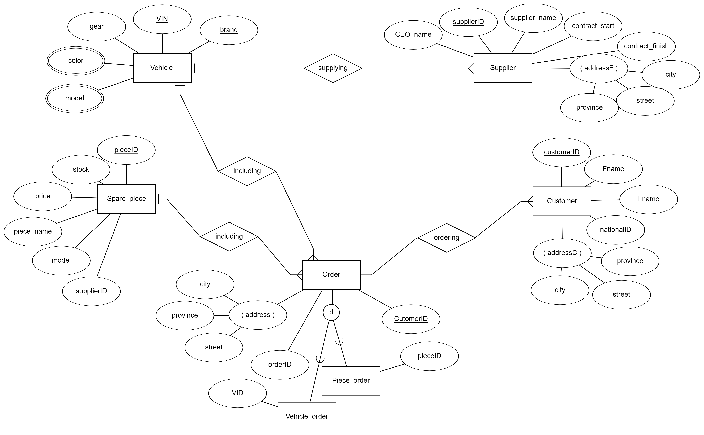

# Vehicle-Factory

In this project, a database is designed for a vehicle factory.

## ER Diagram

Here is the ER diagram for the database:

## Project Description

This project was developed as a part of the Principles of Database Design course at [Amirkabir University of Technology](https://aut.ac.ir/en/) in the fall of 2022. The goal was to design a database for a vehicle factory that could store information about various aspects of the manufacturing process, including suppliers, parts, employees, and production.

## Database Schema

 The database schema is defined in the phase2.sql file. It includes the following tables:

    customers: stores information about customers who have purchased vehicles
    employees: stores information about employees who work at the factory
    orders: stores information about orders placed by customers
    parts: stores information about parts used in vehicle manufacturing
    production: stores information about the production process, including which employees are working on which vehicles and when
    suppliers: stores information about suppliers who provide parts to the factory
    vehicles: stores information about the vehicles being manufactured, including their make, model, and year

## Conclusion

This database can be used to store and manage data related to vehicle manufacturing, including customers, employees, suppliers, parts, and production. The ER diagram provides a visual representation of the relationships between the various tables in the database.
